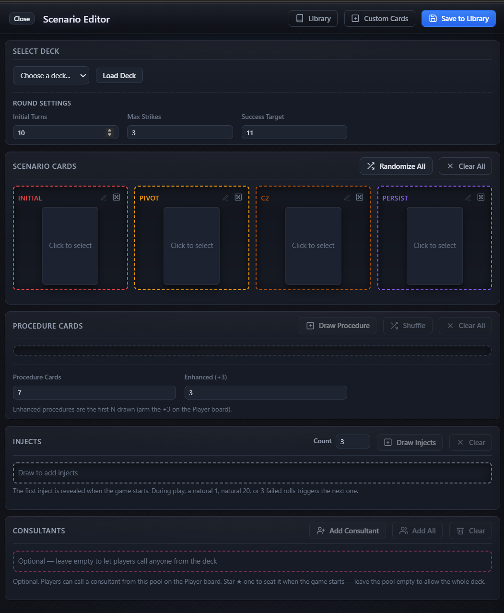

# B&B-Shuffle Engine-V2 — live demo (GitHub Pages)

Modern, responsive dashboard for conducting [Backdoors & Breaches](https://www.blackhillsinfosec.com/projects/backdoorsandbreaches/) sessions remotely.

> **This branch is a read-only live demo of Engine V2.** It is plain static files,
> published straight to GitHub Pages. Nothing a visitor does is written to the site.

Backdoors & Breaches is the property of [Black Hills InfoSec](https://www.blackhillsinfosec.com/). It is a cutting-edge tool for conducting incident response walkthroughs and cybersecurity training seminars.

<table>
  <tr>
    <td></td>
    <td></td>
  </tr>
  <tr>
    <td style="text-align: center;">Player Interface</td>
    <td style="text-align: center;">Admin Interface</td>
  </tr>
</table>

<a href="https://www.blackhillsinfosec.com/">
  <svg width="200" height="60" xmlns="http://www.w3.org/2000/svg">
    <rect width="200" height="60" fill="#1e293b" rx="8"/>
    <text x="100" y="25" font-family="Arial, sans-serif" font-size="14" font-weight="bold" text-anchor="middle" fill="white">Black Hills InfoSec</text>
    <text x="100" y="45" font-family="Arial, sans-serif" font-size="10" text-anchor="middle" fill="#94a3b8">Cybersecurity Excellence</text>
    <circle cx="25" cy="30" r="8" fill="#10b981" opacity="0.8"/>
    <polygon points="175,20 185,30 175,40" fill="#3b82f6" opacity="0.8"/>
</svg>
</a>

## Deploy to GitHub Pages

1. Push this branch to GitHub.
2. **Settings → Pages → Build and deployment → Source: GitHub Actions** — the
   included workflow (`.github/workflows/pages.yml`) uploads the repository root
   on every push to `main`/`master`. Publishing from a different branch? Edit the
   `branches` list in that file, or run it by hand from the Actions tab.
3. The site appears at `https://<user>.github.io/<repo>/`.

Prefer no workflow? Choose **Deploy from a branch** in step 2 and pick the branch
plus `/ (root)` — the site needs no build step either way. `.nojekyll` is committed
so Pages serves every folder verbatim (Jekyll would otherwise skip paths that
start with an underscore).

## License & Attribution

This project is licensed under the **GNU General Public License v3.0** — see [`LICENSE`](LICENSE).

- [`blackhillsinfosec/play.backdoorsandbreaches.com`](https://github.com/blackhillsinfosec/play.backdoorsandbreaches.com),

released under GPL-3.0. Files derived from those projects retain the GPL-3.0
license and their original copyright notices. `Engine-V2` is a modified/refactored
version of that codebase and is likewise distributed under GPL-3.0. See [`NOTICE`](NOTICE)
and [`THIRD-PARTY-NOTICES.md`](THIRD-PARTY-NOTICES.md) for details.

> **Trademark / content notice:** This is an **unofficial community project**. *Backdoors & Breaches* is a game by Black Hills Information Security & Antisyphon Training. This project is **not affiliated with, endorsed by, or sponsored by** Black Hills Information Security or Antisyphon Training. Card artwork, card text, and game design are the property of Black Hills Information Security and their respective sponsors, and are **not** covered by this project's GPL license. A separate content license from the rights holders is required to redistribute those assets.

## Support & Contributions

- For issues, feature requests, or contributions, please visit the project repository.
- Dont forget to visit [Black Hills InfoSec](https://www.blackhillsinfosec.com/tools/backdoorsandbreaches/classic)